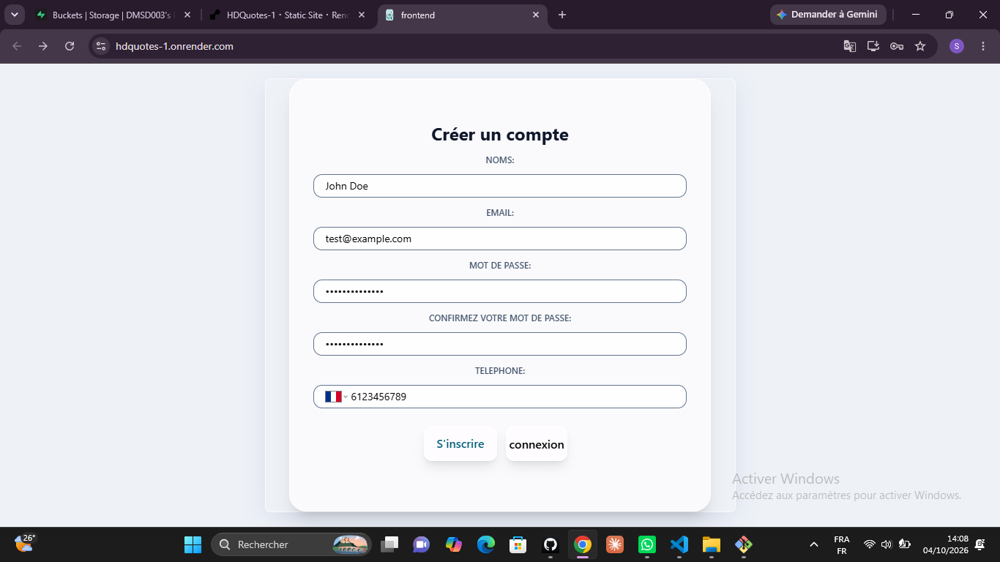
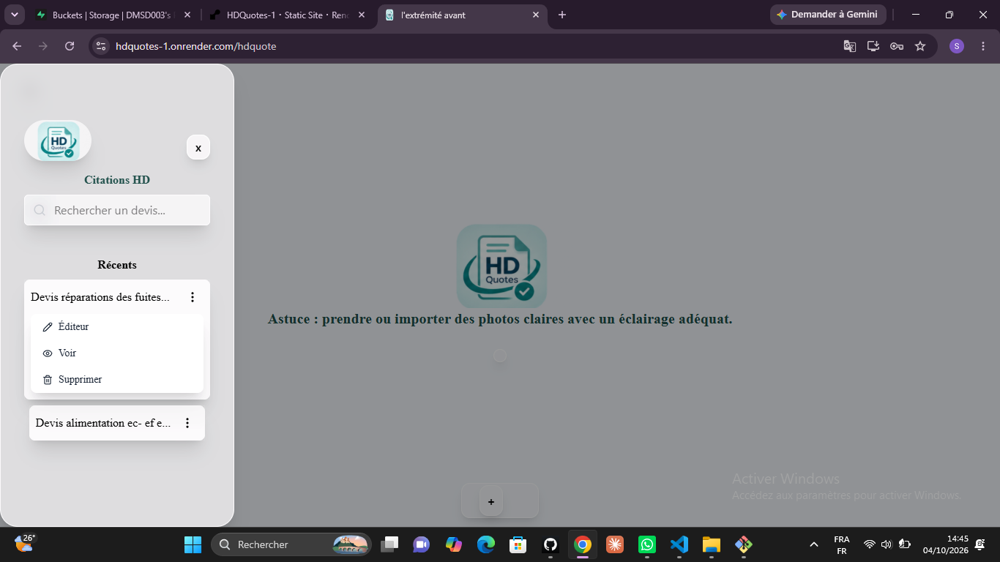
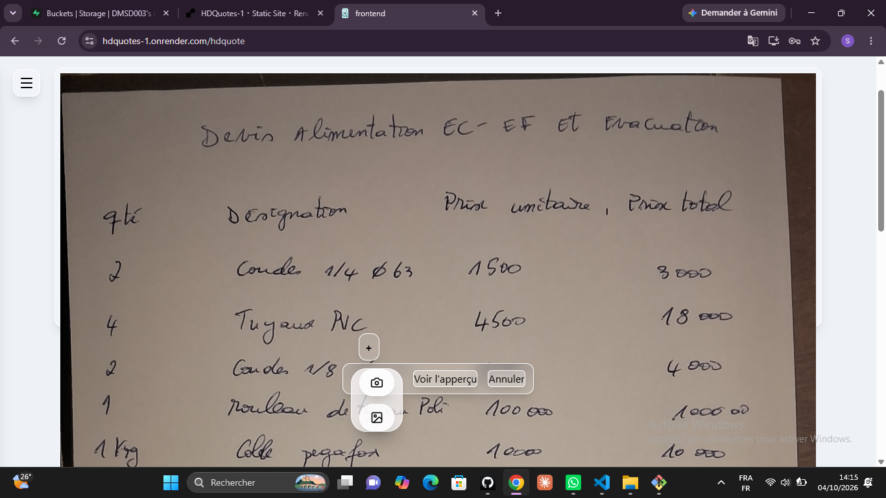

# HDQuotes

## Scan or upload hand writent quotes and generate a professional PDF quote

## Presentation

HDQuotes is an application (PWA for instanct) that helps t create a and manage quotes. It's composed of a frontend React (React js) and of a backend Express, with a data base PostgreSQL and a Gemini integretion instead of a classic ORC. It is more expensive (budget for Gemini API calls), it might hallucinate if Images (captured or uploaded ) are ambiguous and The OCR is faster than an API call but the AI understand the context that i gave him and send me back directly a json while with OCR it's more complex to extract data. That's the core of my system.


**Live demo:** [https://hdquotes-1.onrender.com](https://hdquotes-1.onrender.com)

## Demo account
| Email           | Password     |
|-----------------|--------------|
|test@example.com |myPassword123.|

The demo account already contains sample quotes so you can explore right away.

## Screeshots


    |

    |

    |


## Features
    -   Register/ Login
    -   Capture or upload photos of a document
    -   Ai analysis of the images
    -   Generate and download the PDF
    -   Search, edit, see, and delete quotes
    -   Downloadable application
    -   Responsive interface

## Technologies

    Frontend    |   React + vite-plugin-pwa + tailwind
    Backend     |   Node.js + Express
    Data Base   |   PostgreSQL (supabase)
    Storage     |   supabase storage (PDFs)
    IA          |   Gemini (Google)
    Authentification    |   JWT
    Project Size        |   Monorepo(frontend/backend)
    Deployment          |   Render


## Installation and getting started
1. Clone/Fork the Github repo
    [repo link](https://github.com/DMSD003/HDQuotes.git) (then do cd backend or cd frontend)
2. Install dependencies
    npm install
3. Lanch the application in development mode
    npm run dev (or npm run build for the frontend)

## Environment variables
**backend/.env
```
    DB_PORT=
    DB_HOST=
    DB_USER=
    PORT=
    DB_PASSWORD=
    DB_NAME=
    JWT_SECRET=
    EMAIL_USER=
    EMAIL_APP_PASSWORD=
    GEMINI_API_KEY=
    SUPABASE_URL=
    SUPABASE_ANON_KEY=
    DATABASE_URL=
```
**frontend/.env
```
    VITE_API_URL=
```

## Project structure
HDQuotes/
    |----backend/ (controllers, services, routes, db)
    |----frontend/ (components, pages)

## Future ameliorations
    1. Improve security,for users, for token with cookies and apply refresh token,
    2. Add User management system to madify, delete and add informations,
    3. Improve user experience by adding dark theme, styles and increase performance by using appropriate hooks such as reactMemo or useCallbak,
    4. Add more templates of Generated PDFs
    6. Finish the forgot password work flow

## Author
Daniels Djombissi, https://github.com/DMSD003
